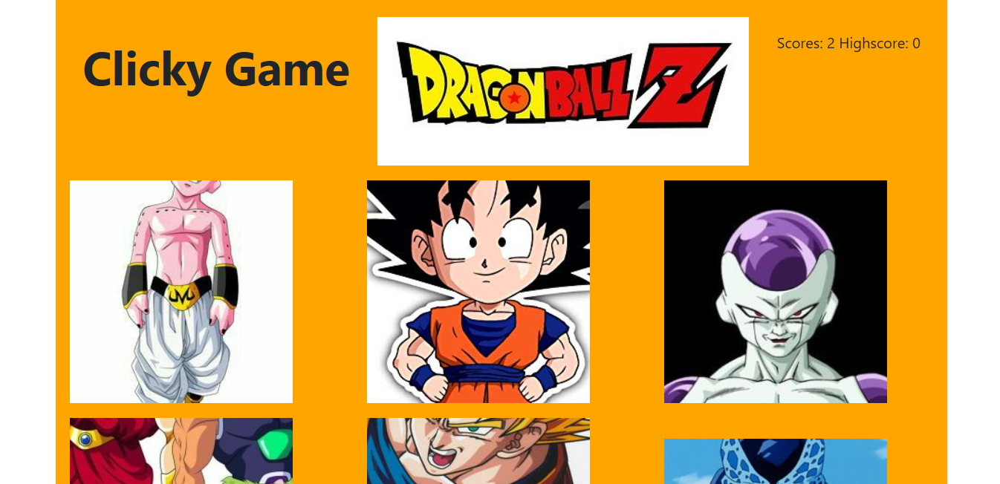

# ClickyGame Dragon Ball Z

## Overview

The Clickster is a web game application where users click images of dragon ball Z character in order to make points. The only catch is that the characters move in their location with every click. If click the same character twice you lose.

## Heroku deploy

Play the game here [DragonBallZ] (https://ancient-caverns-87467.herokuapp.com/)


text: 

## How to Install and Run
```bash
* git clone the repo
* Run npm install to get dependencies
* cd into clickyGame
* Run npm start
* go to localhost 3000 im web browser
```
 
## Technologies used
React.js

## Author 
Guillermo Lara